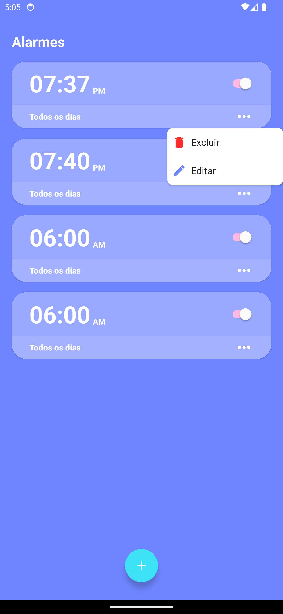
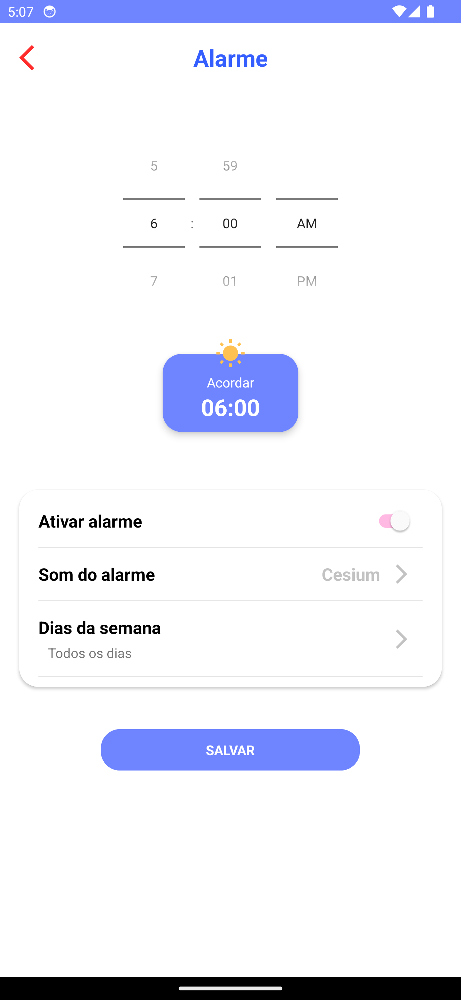
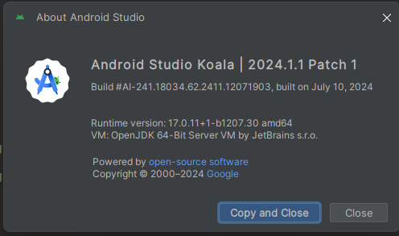
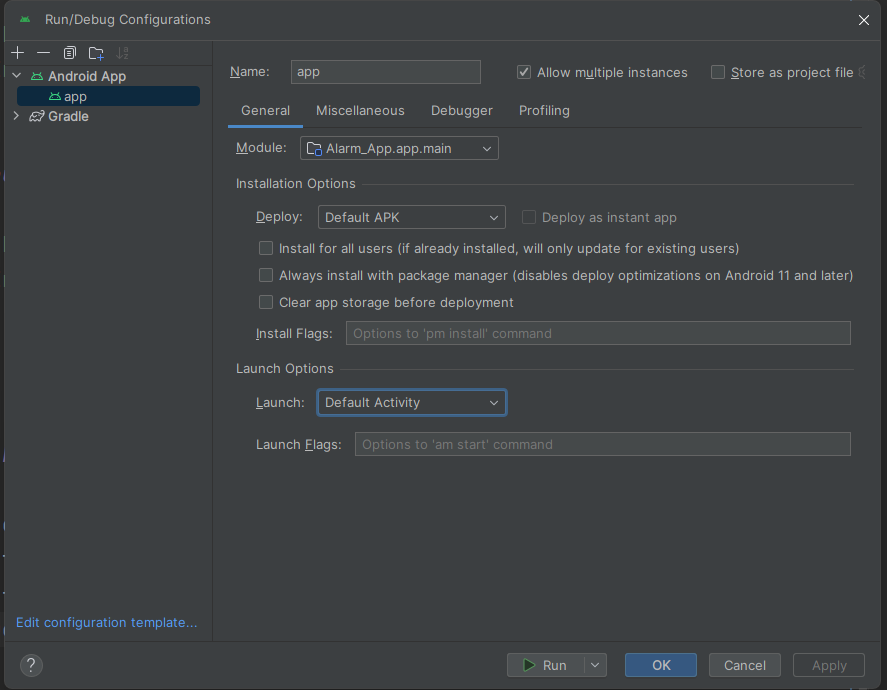
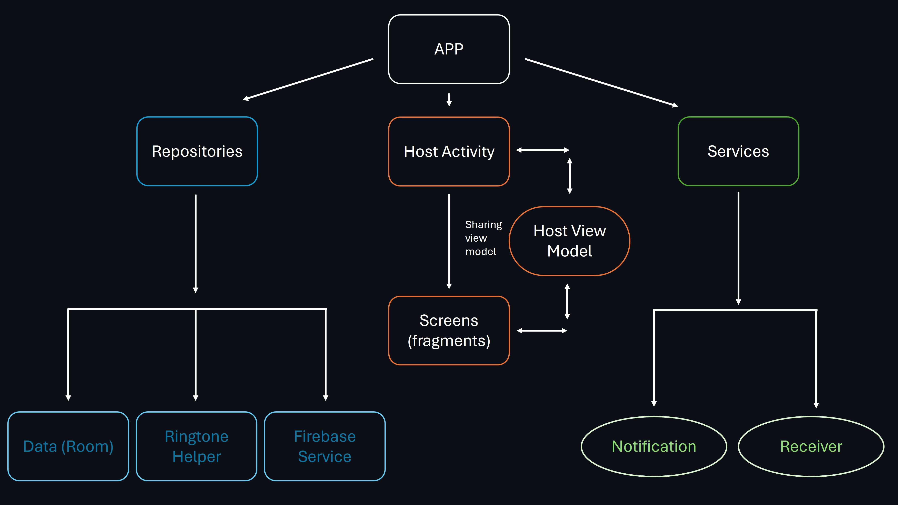
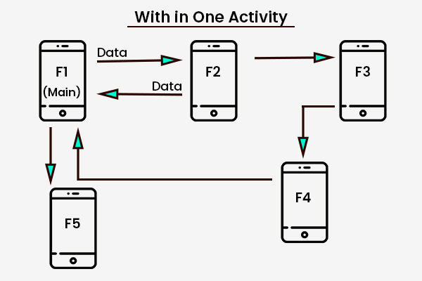

# alarm_app_android
It's a common alarm app with a clean design, kotlin language and Android framework.

---

## App Features

Basically you can create, delete and update alarms:

* See and delete alarms:



* Create and update alarms:



---

## Android General Settings

```
compileSdk 34
minSdk 28           // min android OS: Android 9 (Pie)
targetSdk 34        // target android OS: Android 14 (Upside Down Cake)

buildFeatures {
    buildConfig true        // enable build configs
    viewBinding true        // enable view binding
}
```

Java version:
```
compileOptions {
    sourceCompatibility JavaVersion.VERSION_17
    targetCompatibility JavaVersion.VERSION_17
}
```

Android gradle plugin version: 8.5.1

Gradle version: 8.7

---

## IDE Configs

I'm using [Android Studio](https://developer.android.com/studio) Koala version:
```
Android Studio Koala | 2024.1.1 Patch 1
Build #AI-241.18034.62.2411.12071903, built on July 10, 2024
Runtime version: 17.0.11+1-b1207.30 amd64
VM: OpenJDK 64-Bit Server VM by JetBrains s.r.o.
```



---

## Technologies
This app was developed in native Android using:

- [Kotlin](https://kotlinlang.org/docs/home.html)
- [MVVM](https://developer.android.com/topic/libraries/architecture/viewmodel)
- [DataStorage](https://developer.android.com/codelabs/android-preferences-datastore)
- [Navigation](https://developer.android.com/guide/navigation/navigation-getting-started)
- [View Binding](https://developer.android.com/topic/libraries/view-binding)
- [Hilt](https://developer.android.com/training/dependency-injection/hilt-android)
- [Firebase](https://firebase.google.com/)
- [Material Design](https://m3.material.io/)

---

## Build variants

This project has 2 different build variants:

### release 
```
debuggable false
minifyEnabled true
```

### debug
```
debuggable true
minifyEnabled false
```

---

## Run Project

1. Clone [this](https://github.com/L-Mosca/alarm_app_android.git) repository
2. Create your firebase project and add _google-service.json_ inside 'app' directory 
   1. If you needn't use firebase features, delete "firebase_service" and "track_repository" directories and delete their dependency injections ("Module" object).
   2. Delete BaseFragment _onResume_ and BaseViewModel _trackRepository_ references.
3. Use default app run configuration

Run configuration example:



---

## Design System

### App structure


### Single Activity 

This app use single activity pattern where my software has only one activity. This activity contains a fragment container view where i inflate all my fragments.

I'm using this methodology because it's most simple to control app navigation, global events and it's avoids to much bureaucracy (activity declaration on manifest, for example)



### Architecture

I'm using MVVM architecture, so my app basically contains 3 layers:

View >> ViewModel >> Repository

View << ViewModel << Repository

View: UI elements that render the data on the screen..
ViewModel: State holders (that hold data, expose it to the UI, and handle logic).
Repository: Data Layer (call external or internal services to return any data).


---

Last update: 08/2024